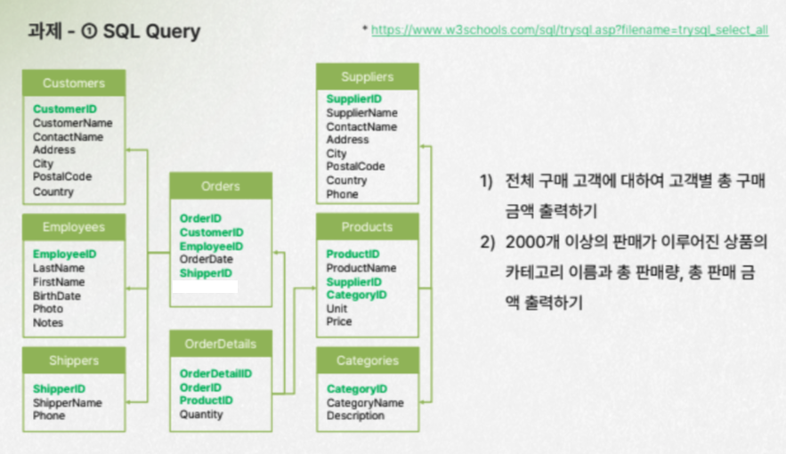
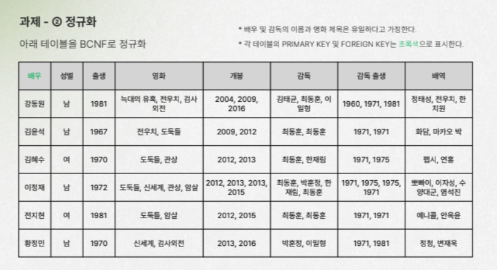
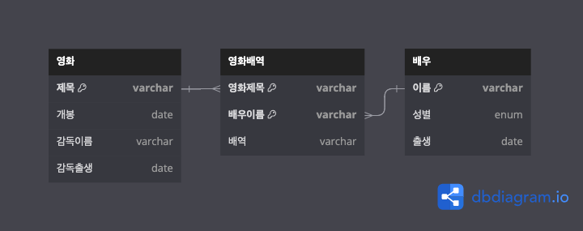
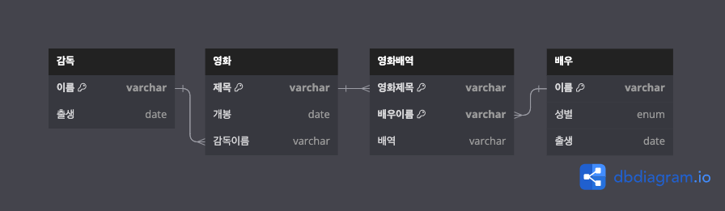

# DB, SQL

## 과제 1



[1-1 query](task1/1-1.sql)

```sql
SELECT c.customerId,
    sum(od.quantity * p.price) revenue
FROM customers c
    INNER JOIN orders o ON o.customerId = c.customerId
    INNER JOIN orderDetails od ON od.orderId = o.orderId
    INNER JOIN products p ON p.productId = od.productId
GROUP BY c.customerId
```

[1-1 result](task1/1-1.csv)

[1-2 query](task1/1-2.sql)

```sql
SELECT c.categoryName,
    sum(od.quantity) quantity,
    sum(od.quantity * p.price) revenue
FROM categories c
    INNER JOIN products p ON p.categoryId = c.categoryId
    INNER JOIN orderDetails od ON od.productId = p.productId
GROUP BY c.categoryName
HAVING sum(od.quantity) >= 2000;
```

[1-2 result](task1/1-2.csv)

## 과제 2



1NF

- 모든 컬럼을 atomic value로 변경하고, PK를 (`배우이름`, `영화제목`)으로 변경합니다.


2NF

- `성별`, `출생`은 partial PK 중 `배우이름`에만 종속됩니다. 따라서 이들을 `배우` 테이블로 분리하고 PK를 `배우이름`으로 설정합니다.
- `개봉`, `감독이름`, `감독출생`은 partial PK 중 `영화제목`에만 종속됩니다. 따라서 이들을 `영화` 테이블로 분리하고 PK를 `영화제목`으로 설정합니다.



3NF

- `영화` 테이블의 `감독출생`은 `감독이름`에만 의존하고, `감독이름`은 `영화제목`에만 의존합니다. 따라서 같은 테이블 내의 transitive dependent column인 `감독출생`을 `감독` 테이블로 분리하고 PK를 `감독이름`으로 설정합니다.



BCNF

- 이미 만족합니다.

결과물


[table-dbdiagram.txt](task2/table-dbdiagram.txt) 파일을 복사해 <https://dbdiagram.io/d> 에 붙여넣어 테이블 생성 다이어그램을 확인하실 수 있습니다.
또는 [create-tables.sql](task2/create-tables.sql) 파일에서 테이블 생성 쿼리를 확인하실 수 있습니다.

가능한 문제

- 일반적으로 이름은 변경될 수 있습니다. 실제 DB에 테이블을 생성할 때 변경될 수 있는 값은 PK 지정을 지양하는 것이 좋습니다. 다른 ID, 예컨대 임의의 auto increment 컬럼을 추가해 PK로 사용하는 것을 고려해볼 수 있습니다.
