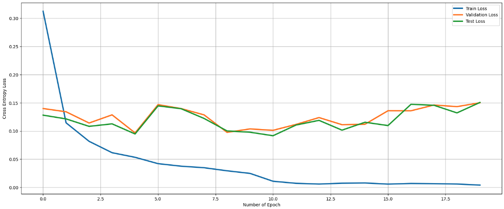
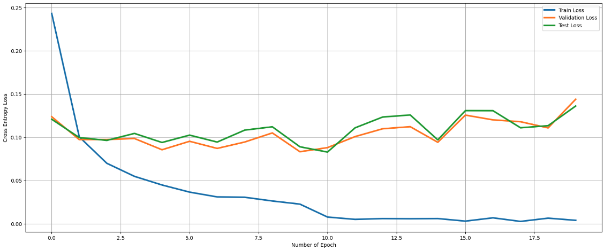

# MLP 과제 수행 결과

## 과제 1

Overfitting model의 optimizer, epoch, learning rate 등을 변경하여 실행한 결과입니다.

[overfit.ipynb](overfit.ipynb)

Underfitting의 layer를 2개 이상 추가하여 실행한 결과입니다.

[underfit.ipynb](underfit.ipynb)

## 과제 2

과제 파일을 수정하여 Test image에 대한 accuracy를 51% 이상으로 높인 결과입니다.

- Linear layer의 파라미터 수를 축소하였습니다. 레이어 수는 그대로입니다.
- Optimizer를 SGD에서 Adam으로 변경하였습니다.
- Learning rate를 0.001에서 0.0005로 감소시켰습니다.
- Epoch을 5회로 늘렸습니다.

[MLP 과제.ipynb](MLP%20과제.ipynb)

최종 정확도는 60%로 기준치를 상회하였습니다.

## 과제 3

MLP model과 기존 ML model의 차이점입니다.

1. 기존의 single layer perceptron에 비해 레이어 수가 많아 모델의 유연성이 높습니다.
2. Feature extraction 및 classification 과정이 모두 모델에 포함되어 있습니다.
