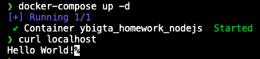
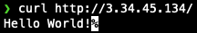

# 0727 AWS, GCP 과제

[도커 컴포즈](docker-compose.yml)를 만들고 로컬에서 실행한 결과입니다.
Node.js 서버가 정상 작동합니다.

`docker-compose push` 명령어를 통해 이미지를 푸시한 결과 [레포지토리](https://hub.docker.com/repository/docker/kimhajin/ybigta_homework_nodejs)가 생성되었습니다.

AWS EC2 인스턴스에 푸시한 이미지를 설치해 실행 및 테스트한 결과입니다.
자동 할당 public IP 주소를 통해 요청 및 응답이 정상적으로 이루어집니다.

