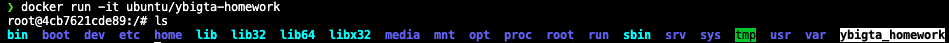
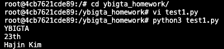
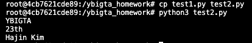
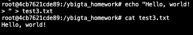
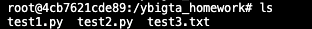

# 0727 Linux, Docker 과제

## `Dockerfile`을 통한 이미지 생성

[Dockerfile](Dockerfile) 파일을 작성하고, 다음 명령어를 통해 이미지를 빌드합니다.

```sh
docker build -t ubuntu/ybigta_homework ./
```

혹은 [docker-compose.yml](docker-compose.yml)를 통해 다음과 같이 빌드 및 실행할 수 있습니다.

```sh
docker-compose run ybigta_homework
```

`docker images`를 통해 빌드 결과물을 확인하면 다음과 같습니다.
정상적으로 빌드되었습니다.

```txt
REPOSITORY                       TAG          IMAGE ID       CREATED          SIZE
ubuntu/ybigta_homework           latest       9e3c563fd1c3   29 minutes ago   199MB
```

## 컨테이너 실행

다음 명령어를 통해 컨테이너를 실행합니다.

```sh
docker run -it ubuntu/ybigta-homework
```

`-it` 옵션을 통한 터미널 실행 및 `ls`를 통한 파일 생성 확인 결과는 다음과 같습니다.
정상적으로 작동하였습니다.



## Python 파일 작성 및 실행

`vim`을 통해 `test1.py` 파일을 작성 및 실행한 결과는 다음과 같습니다.
정상적으로 실행되었습니다.



`cp`를 통해 `test2.py` 파일을 생성 및 실행한 결과는 다음과 같습니다.
정상적으로 실행되었습니다.



`echo`를 통해`test3.txt` 파일을 생성한 결과는 다음과 같습니다.
정상적으로 생성되었습니다.



`ls`를 통해 생성된 파일들을 확인한 결과는 다음과 같습니다.
3개 파일 모두 정상적으로 생성되었습니다.


