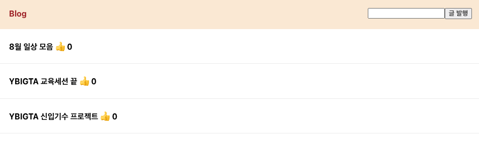
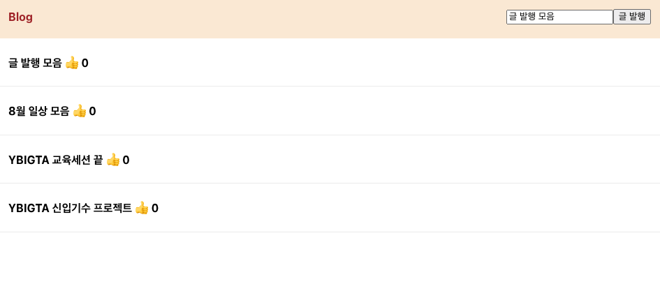
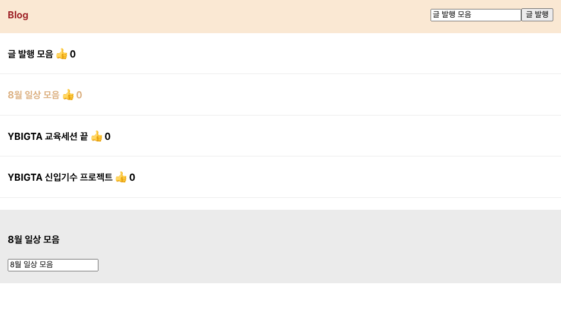
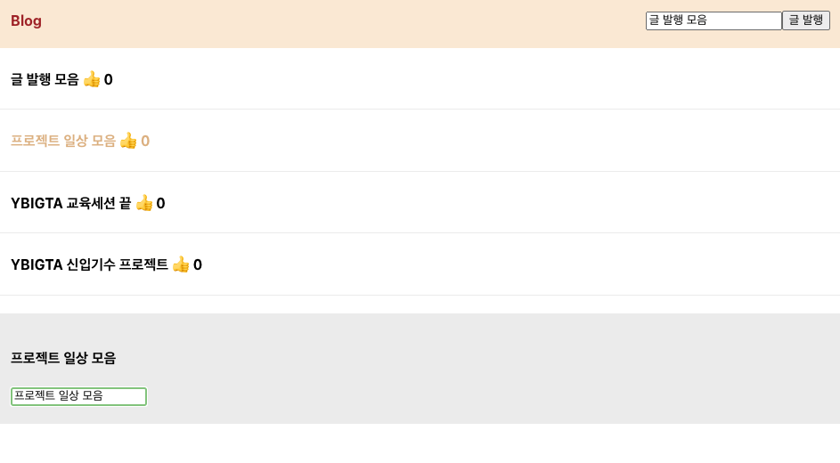
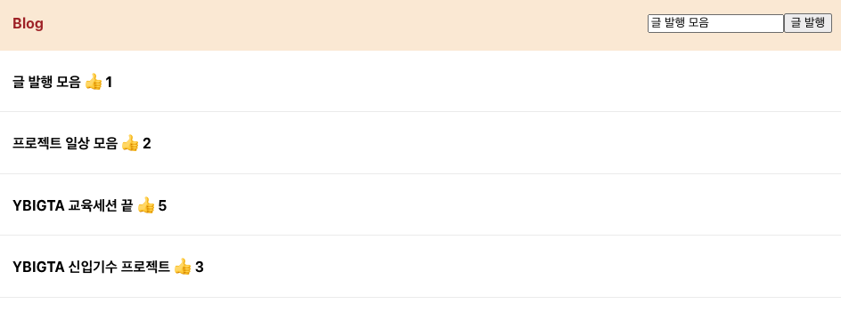

# 0801 FE React 과제

## 실습 앱 수정

상단 헤더 색상을 다음과 같이 변경하였습니다.

글 발행 버튼 왼쪽 인풋에 제목을 기재하고 버튼을 누르면 글이 생성됩니다.

글을 누르면 상세 모달이 표시되고 색상이 변경됩니다.

모달에서 제목을 변경할 수 있습니다.

모달에서 좋아요 텍스트를 누르면 좋아요 숫자가 변경됩니다.

## 코드 분석

### 글 발행 버튼

버튼이 클릭되면 입력된 제목과 좋아요 개수의 초기값을 상태(배열)에 추가합니다.

### 좋아요 텍스트

텍스트가 클릭되면 현재 글의 좋아요 개수를 1 증가시키도록 상태(배열)을 업데이트합니다.
이때 클릭 이벤트가 상위로 전달되지 않게 막아, 현재 글의 모달 표시 여부가 토글되지 않게 할 수 있습니다.

### `Modal` 표시

하단에 정의한 `Modal` 컴포넌트를 생성하고, 필요한 값들을 props로 전달합니다.
이때 모달은 표시 여부가 true이면 생성됩니다.

### `Modal` 컴포넌트

Props로 전달받은 값들을 표시합니다.
